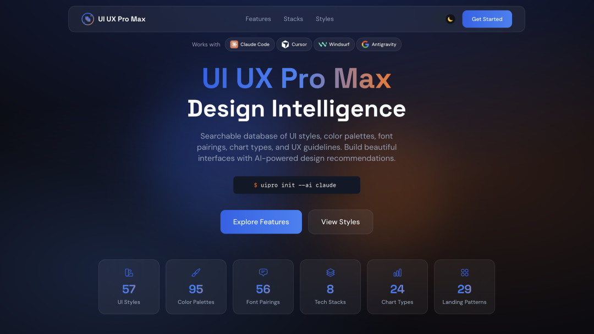
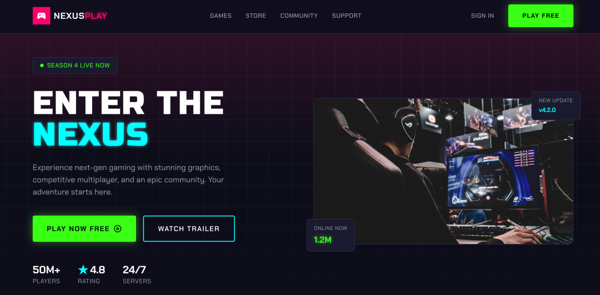
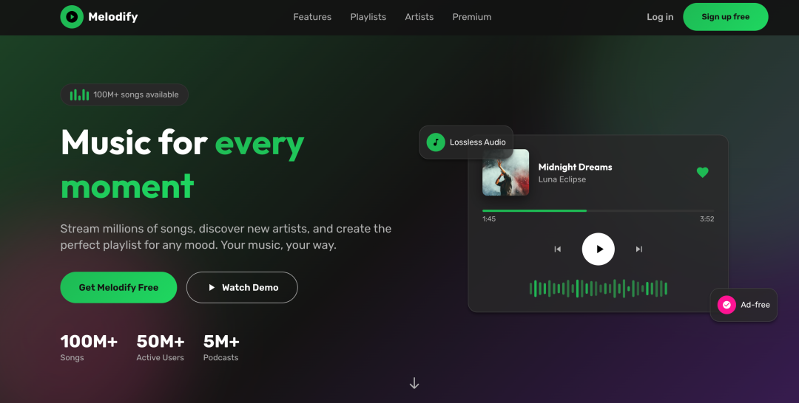

> 📌 原文链接：[https://mp.weixin.qq.com/...](https://mp.weixin.qq.com/s/JDY6dJ4vKav1azgTaxTAmA)  
> 🕘 收藏时间：2026年04月25日  
> 📂 文档目录：**我的云文档/应用/金山收藏助手**  
> 📑 本文档由[【金山收藏助手】](https://kdocs.cn/l/cpRidR7kBnn3)一键生成


用 Claude Code 或者 Cursor 写过前端页面的朋友应该都有这个感受：AI 生成的代码能跑，逻辑也对，但界面就是差点意思。按钮颜色随意，间距不统一，卡片样式混搭，整个页面看起来像是拼凑出来的。

这不是模型能力的问题。Claude 4、GPT-4o 生成的 HTML 质量都不低，但它们不是设计师，没有行业审美经验，也不知道你做的是 SaaS 工具还是美容品牌，更不清楚针对不同行业有哪些设计套路和禁忌。

**ui-ux-pro-max-skill** 这个开源项目，就是专门来填这个坑的。

# 它是什么

简单说，这是一个给 AI 编程工具用的「设计智能」插件，你把它安装到 Claude Code、Cursor、Windsurf 这类工具里之后，AI 在帮你写 UI 代码之前，会先自动生成一套完整的设计系统，包括颜色方案、字体组合、排版规则、交互效果，还有一张「踩雷清单」。

先看一眼项目主页：



项目目前（v2.0）内置的资产挺丰富。UI 风格有 67 种，从 Glassmorphism（磨砂玻璃）到 Brutalism（粗野主义），从 Bento Grid 到 Cyberpunk，基本上你在 Dribbble 上见过的风格都有。

配色方案 161 套，每种方案和一个具体行业一一对应。字体组合 57 套，全部来自 Google Fonts，直接提供导入链接。v2.0 还新增了 161 条行业推理规则，这是整个版本最核心的升级。

另外还有 99 条 UX 规范和 25 种图表类型，规范里包含无障碍设计标准，图表部分主要用于数据看板场景。

支持的技术栈也很全：React、Next.js、Vue、Nuxt.js、Svelte、Astro、Angular、Laravel、SwiftUI、Jetpack Compose、React Native、Flutter，以及最基础的 HTML + Tailwind。

# 从一句话到设计系统，UI UX Pro Max是怎么做到的？

这是 v2.0 最值得说的部分，叫做 **Design System Generator**。

你跟 AI 说「给我的美容 SPA 做一个落地页」，接下来这个 Skill 会在后台自动跑 5 个并行搜索。首先匹配产品类型，在 161 个行业分类里找到「美容 / 水疗」这一项。然后推荐合适的 UI 风格，比如「Soft UI Evolution」。并行确定配色方案（粉色主色、鼠尾草绿辅色、金色点缀）、匹配排版风格（Cormorant Garamond 配 Montserrat）以及生成落地页结构建议（比如 Hero → 服务展示 → 用户评价 → 预约入口 → 联系方式）。

然后这些结果经过一个推理引擎处理，用 BM25 算法做排序，最终输出一份完整的设计系统描述。整个过程在 AI 回复你之前自动完成，你基本感觉不到延迟。

输出格式大概是这样的（以美容 SPA 为例）：

```
+----------------------------------------------------------------------------------------+
|  TARGET: Serenity Spa - RECOMMENDED DESIGN SYSTEM                                      |
+----------------------------------------------------------------------------------------+
|  PATTERN: Hero-Centric + Social Proof                                                  |
|     Sections: Hero → Services → Testimonials → Booking → Contact                      |
|                                                                                        |
|  STYLE: Soft UI Evolution                                                              |
|     Keywords: Soft shadows, subtle depth, calming, premium feel                        |
|                                                                                        |
|  COLORS:                                                                               |
|     Primary:    #E8B4B8 (Soft Pink)                                                    |
|     Secondary:  #A8D5BA (Sage Green)                                                   |
|     CTA:        #D4AF37 (Gold)                                                         |
|                                                                                        |
|  TYPOGRAPHY: Cormorant Garamond / Montserrat                                           |
|                                                                                        |
|  AVOID: Bright neon colors, harsh animations, AI purple/pink gradients                 |
+----------------------------------------------------------------------------------------+
```

AI 拿到这份设计系统之后，再开始写代码。效果和你什么都不说直接让它写，是两个档次。

# 161 条规则，更专业

很多工具说自己有多少条规则，其实就是凑文档字数。这个项目的 161 条行业推理规则，是真的在做行业区分。

以金融行业为例，规则里明确写着：避免「AI 紫色/粉色渐变」（这类配色现在在科技圈很流行）。原因很简单，银行和保险产品需要传达稳定、可信的感觉，用那种网红 AI 配色会让用户觉得不靠谱。

医疗诊所和心理健康类产品也有类似的限制，比如禁止使用高对比度的警告色调，因为这类场景需要让用户放松，不是让他们紧张。

游戏和 NFT 类产品则反过来，赛博朋克、霓虹灯、高饱和度渐变都是推荐选项。

行业覆盖范围也比较全：

| 行业 | 覆盖示例 |
| --- | --- |
| 科技 / SaaS | 微 SaaS、开发者工具、AI 平台、网络安全 |
| 金融 | 加密货币、银行、保险、个人财务 |
| 医疗 | 诊所、牙科、心理健康、宠物医院 |
| 电商 | 普通、奢侈品、订阅盒子、外卖平台 |
| 服务业 | 美容、餐饮、酒店、法律、家政 |
| 创意 | 作品集、摄影、音乐平台、游戏 |
| 生活方式 | 习惯追踪、冥想、食谱、日记 |
| 新兴技术 | Web3、空间计算、量子计算 |

每条规则包含：推荐的页面结构模板、首选 UI 风格、配色情绪、字体个性、关键交互效果，还有反向的「不要这样做」清单。

# 67 种风格，拿来直接用

67 种 UI 风格里，通用风格有 49 种，另有 8 种落地页专属风格和 10 种数据看板专属风格。

选几个有代表性的说一下：

**Glassmorphism（磨砂玻璃）**：适合现代 SaaS 和金融看板。背景模糊 + 半透明卡片，视觉层次感强。缺点是滥用会导致对比度不够，规则里有 WCAG AA 对比度检查。

**Claymorphism（黏土风）**：适合教育类应用和面向儿童的产品。圆角、柔和阴影、饱和色。这两年在 SaaS 落地页上也比较流行。

**Neubrutalism**：Gen Z 品牌、初创公司常用。厚边框、高对比度、平面阴影。Figma 官网用的就是类似的路子。

**Bento Box Grid**：产品功能展示、个人主页常见布局。各种大小不一的卡片拼在一起，Apple 和很多科技公司在用这个。

**AI-Native UI**：为 AI 产品和聊天机器人定制的风格，强调信息流动感和状态反馈。

每种风格都标注了「最适合什么场景」，不用自己猜。你只要告诉 AI 做什么产品，它会自动匹配。

# 安装

> *一条命令搞定*

支持的 AI 编程工具很多，安装方式也不复杂。

**方法一：Claude Marketplace（Claude Code 专属）**

```
/plugin marketplace add nextlevelbuilder/ui-ux-pro-max-skill
/plugin install ui-ux-pro-max@ui-ux-pro-max-skill
```

**方法二：CLI 安装（推荐，支持所有平台）**

先全局安装 CLI 工具：

```
npm install -g uipro-cli
```

然后在你的项目目录里初始化：

```
uipro init --ai claude      # Claude Code
uipro init --ai cursor      # Cursor
uipro init --ai windsurf    # Windsurf
uipro init --ai copilot     # GitHub Copilot
uipro init --ai gemini      # Gemini CLI
uipro init --ai all         # 全部平台
```

还支持全局安装，装一次所有项目都能用：

```
uipro init --ai claude --global
```

支持的平台目前有 17 个，包括 Cursor、Windsurf、GitHub Copilot、Kiro、Roo Code、Augment、Warp 等等，基本上主流的 AI 编程工具都覆盖了。

安装只依赖 Python 3.x，没有其他特殊要求。

# 设计系统可以存下来跨 session 用

这是个实用性很强的功能，但很多人不知道。

AI 默认是没有记忆的，你每次开新对话，上次生成的设计系统就没了，风格容易飘。这个项目提供了一个「Master + 覆盖」的持久化方案：

```
# 生成并保存全局设计系统
python3 .claude/skills/ui-ux-pro-max/scripts/search.py "SaaS dashboard" --design-system --persist -p "MyApp"

# 为特定页面生成差异覆盖文件
python3 .claude/skills/ui-ux-pro-max/scripts/search.py "checkout page" --design-system --persist -p "MyApp" --page "checkout"
```

执行完之后，项目目录里会多出这样的结构：

```
design-system/
├── MASTER.md           # 全局设计系统（颜色、字体、组件规范）
└── pages/
    └── checkout.md     # 结账页面的特殊覆盖规则
```

使用方式很直接：新开对话时告诉 AI 先读 `design-system/MASTER.md`，如果当前页面有对应的覆盖文件就优先用那个。这样整个项目的视觉风格就能保持一致，不管开了多少次新对话。

# 适合谁，不适合谁

最适合用的是独立开发者或小团队，没有专职设计师，但又不想让产品看起来太素。或者你在用 AI 工具快速出原型，需要一个能直接用的视觉规范，也很合适。前端代码写得不错但对颜色和排版没什么感觉的人，用起来收益感会比较明显。

有几类场景不太适合。公司已经有完整的设计规范（Design Token、Figma 文档），用自己的规范更合适，没必要引入外部预设。产品有非常特殊的品牌识别需求，要做深度定制，靠预设模板不够用。对 UI 细节要求极高的场景，AI 出的结果还是需要设计师再过一遍。

说实话，这个项目不能替代设计师，但对于很多开发者来说，有它和没它的区别，是「能上线」和「有点拿不出手」的区别。

# 成果展示

金融仪表盘


游戏平台



音乐网站



诊所门户网站


更多案例参考：

> *https://www.uupm.cc/**#styles*

# 最后

项目目前在 GitHub 的 Star 增长还挺快，v2.0 的 Design System Generator 是一个不小的升级。MIT 协议，免费用。


如果你在用 Claude Code 或者 Cursor 做前端，可以装来试试，成本很低。

GitHub 地址：*https://github.com/nextlevelbuilder/ui-ux-pro-max-skill*

***后端专属技术群***

构建高质量的技术交流社群，欢迎从事编程开发、技术招聘HR进群，也欢迎大家分享自己公司的内推信息，相互帮助，一起进步！

> 文明发言，以`交流技术`**、**`职位内推`**、**`行业探讨`为主

**广告人士勿入，切勿轻信私聊，防止被骗**


加我好友，拉你进群

点下方的**“❤****”**支持我们，非常感谢！


极客之家